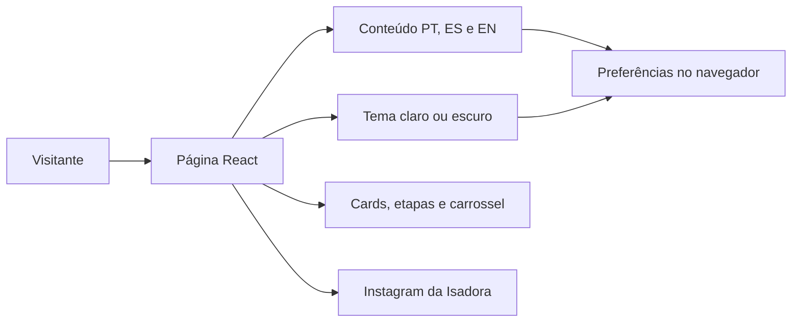

<p align="center">
  <strong>BLÁ BLÁ BLANDO</strong><br />
  <em>by Isaduera</em>
</p>

# Blá Blá Blando by Isaduera

**Landing page responsiva e trilíngue para apresentação das aulas online de idiomas da professora Isadora.**

[](package.json)
[](package.json)
[](jsconfig.json)
[](app/globals.css)

A página apresenta aulas online de português, espanhol e inglês com uma experiência leve, acolhedora e adaptável. O visitante pode alternar todo o conteúdo entre português, espanhol e inglês, escolher o tema claro ou escuro e explorar cursos, formatos, metodologia e depoimentos por meio de componentes interativos.

O projeto foi criado como uma proposta visual para a cliente. Informações profissionais, fotografias, depoimentos e detalhes comerciais ainda marcados como provisórios devem ser substituídos após validação. A identidade, o nome de Isadora, o formato exclusivamente online e o perfil [@bbbisaduera](https://www.instagram.com/bbbisaduera/) foram informados pela cliente.

## Sumário

- [Funcionalidades e estado atual](#funcionalidades-e-estado-atual)
- [Interface](#interface)
- [Tecnologias e arquitetura](#tecnologias-e-arquitetura)
- [Estrutura do repositório](#estrutura-do-repositório)
- [Instalação](#instalação)
- [Execução local](#execução-local)
- [Comandos e verificações](#comandos-e-verificações)
- [Personalização do conteúdo](#personalização-do-conteúdo)
- [Responsividade e acessibilidade](#responsividade-e-acessibilidade)
- [Publicação](#publicação)
- [Contribuição e licença](#contribuição-e-licença)

## Funcionalidades e estado atual

| Área | Recursos presentes | Estado e limites |
| --- | --- | --- |
| Apresentação | Hero, proposta de valor, idiomas, metodologia, apresentação da professora, formatos, depoimentos e chamada final | Estrutura pronta; fotografias e parte dos textos continuam provisórios |
| Internacionalização | Tradução completa para português, espanhol e inglês | Idioma escolhido é salvo no navegador com `localStorage` |
| Tema | Modos claro e escuro, com paleta derivada da referência visual fornecida | Preferência é salva e o primeiro acesso respeita o tema do sistema |
| Interações | Cards de idiomas e formatos selecionáveis, metodologia expansível, carrossel de depoimentos e menu móvel | Interações locais, sem banco de dados ou painel administrativo |
| Contato | Chamadas direcionadas ao Instagram da professora | Não há formulário, WhatsApp, e-mail ou outro contato não confirmado |
| Conteúdo | Textos centralizados por idioma em um único módulo | Depoimentos são exemplos ilustrativos e estão identificados como provisórios |
| Responsividade | Layouts específicos para desktop, tablet e celular | Validado por compilação; fotografias finais ainda podem exigir novos ajustes de enquadramento |

## Interface

A direção visual utiliza azul-marinho, verde vibrante, azul-claro e fundos neutros. A referência enviada pela cliente foi usada somente para inspiração cromática; nenhum texto, horário, oferta, fotografia ou dado do material original foi reutilizado.

Os principais elementos da experiência são:

- cabeçalho com identidade, navegação, seletor de idioma e tema;
- apresentação imediata das aulas exclusivamente online;
- seleção de português, espanhol ou inglês com conteúdo contextual;
- etapas da metodologia abertas sob demanda;
- formatos de aula selecionáveis;
- depoimentos ilustrativos em carrossel;
- acesso direto ao Instagram `@bbbisaduera`;
- controles móveis reposicionados para preservar a área útil da tela.

## Tecnologias e arquitetura

| Camada | Tecnologias | Responsabilidade |
| --- | --- | --- |
| Interface | Next.js 16, React 19 e JavaScript | Estrutura da página, estado dos controles e renderização dos conteúdos |
| Estilos | CSS global, Tailwind CSS 4 e tokens CSS | Tema, responsividade, animações e identidade visual |
| Ícones | Lucide React | Ícones de ações, navegação e elementos informativos |
| Conteúdo | Objeto JavaScript trilíngue | Textos em português, espanhol e inglês sem duplicação de páginas |
| Build | Vinext e Vite | Desenvolvimento local e geração do artefato para Cloudflare Workers |
| Hospedagem | OpenAI Sites / Cloudflare Workers | Publicação privada da versão validada |



O componente principal em `app/page.jsx` controla idioma, tema, menu móvel e elementos selecionáveis. Os textos ficam separados em `app/content.js`, enquanto `app/globals.css` concentra a identidade visual e os breakpoints. A página não depende de API ou banco de dados para funcionar.

## Estrutura do repositório

```text
prof-auto/
├── app/
│   ├── content.js              # Conteúdo completo em PT, ES e EN
│   ├── globals.css             # Tema, layout, animações e responsividade
│   ├── layout.jsx              # Metadados e layout raiz
│   └── page.jsx                # Landing page e interações
├── build/
│   └── sites-vite-plugin.js    # Integração de build e hospedagem
├── components/ui/              # Componentes reutilizáveis disponíveis
├── public/                     # Arquivos públicos e favicon
├── scripts/                    # Instalação e configuração local do Sites
├── components.json             # Configuração dos componentes em JavaScript
├── eslint.config.mjs           # Regras de análise estática
├── jsconfig.json               # Alias de imports e configuração JavaScript
├── next.config.js              # Configuração do Next.js
├── package.json                # Dependências e comandos do projeto
├── package-lock.json           # Versões resolvidas das dependências
├── vite.config.js              # Vinext, Vite e ambiente Cloudflare
└── README.md                   # Documentação do projeto
```

Diretórios gerados, como `node_modules`, `dist`, `.next`, `.vinext` e `.wrangler`, não devem ser editados manualmente e não fazem parte da estrutura autoral da landing page.

## Instalação

### Pré-requisitos

- Node.js `22.13.0` ou superior;
- npm disponível na instalação do Node.js;
- Git para versionamento e publicação.

Na raiz do projeto:

```powershell
npm ci
```

O comando instala exatamente as versões registradas em `package-lock.json`. Não há variáveis de ambiente obrigatórias para abrir a landing page localmente.

## Execução local

Inicie o ambiente de desenvolvimento:

```powershell
npm run dev
```

A página fica disponível por padrão em [http://localhost:5173](http://localhost:5173). O servidor possui atualização automática durante a edição dos arquivos em `app/`.

Para encerrar, use `Ctrl+C` no terminal. Evite iniciar uma segunda instância enquanto a primeira estiver ativa.

## Comandos e verificações

| Comando | Efeito |
| --- | --- |
| `npm run dev` | Inicia o ambiente de desenvolvimento com atualização automática |
| `npm run build` | Gera e valida o artefato de produção com Vinext |
| `npm run lint` | Executa a análise estática do projeto com ESLint |
| `npm run start` | Serve localmente um build existente pelo runtime do Cloudflare |
| `npm run install:ci` | Executa a instalação bloqueada usada pelo fluxo do Sites |

Não há suíte de testes automatizados de interface. A validação atual cobre compilação, resolução dos módulos e regras do ESLint.

## Personalização do conteúdo

### Textos e traduções

Todo o texto visível está em [`app/content.js`](app/content.js), agrupado pelas chaves `pt`, `es` e `en`. Ao modificar uma seção, mantenha as mesmas propriedades nos três idiomas para evitar conteúdo ausente durante a troca.

### Identidade e links

- Nome e assinatura da marca: `app/page.jsx` e `app/layout.jsx`;
- Instagram: constante `instagramUrl` em `app/page.jsx`;
- título e descrição exibidos pelo navegador: `app/layout.jsx`;
- cores dos temas claro e escuro: variáveis no início de `app/globals.css`;
- favicon e arquivos públicos: diretório `public/`.

### Fotografias

Os blocos “Foto principal da Isadora” e “Foto da Isadora” são placeholders intencionais. Quando as imagens forem recebidas, salve os arquivos em `public/`, use o componente de imagem do Next.js e preserve as proporções definidas pelas classes `.photo-hero` e `.photo-about`.

### Informações provisórias

Não transforme textos ilustrativos em afirmações reais sem confirmação. Antes de uma publicação definitiva, revise:

- história e apresentação profissional de Isadora;
- formatos de aula efetivamente disponíveis;
- informações sobre aulas individuais ou em grupo;
- metodologia e objetivos de cada idioma;
- fotografias autorizadas;
- depoimentos reais e consentimento para publicação.

## Responsividade e acessibilidade

- HTML semântico com `header`, `nav`, `main`, `section` e `footer`;
- botões com estados `aria-pressed` ou `aria-expanded` quando aplicável;
- controles de tema e menu com rótulos acessíveis;
- contraste específico para os temas claro e escuro;
- respeito à preferência `prefers-reduced-motion`;
- idioma do documento atualizado quando o visitante troca entre PT, ES e EN;
- navegação e controles dimensionados para toque em telas menores.

## Publicação

A versão de demonstração está hospedada de forma privada em:

[https://professora-idiomas-personalizados.appono-br.chatgpt.site](https://professora-idiomas-personalizados.appono-br.chatgpt.site)

O endereço exige acesso autorizado pela plataforma de hospedagem. Para uso em portfólio público, será necessário publicar o projeto em um ambiente público ou alterar conscientemente a política de acesso do Sites.

## Contribuição e licença

O projeto não possui `CONTRIBUTING.md` nem um fluxo formal de contribuições. Alterações devem preservar a versão em JavaScript, a equivalência dos três idiomas e o comportamento dos dois temas.

Não há um arquivo `LICENSE` na raiz. O campo `private: true` do `package.json` impede a publicação acidental como pacote npm, mas não define uma licença de uso, distribuição ou reprodução do código. Uma licença deverá ser escolhida antes de disponibilizar o repositório publicamente.
